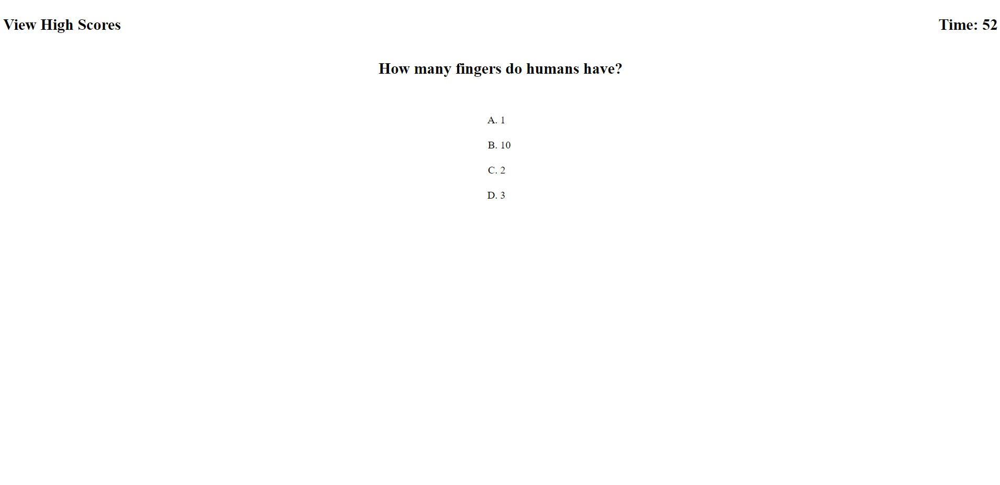

# 04_quiz

## Description

This project was done in order to practice adavnce Javascript principles, such as local storage,
timers, and using events.
The created website acts as a timed quiz, with users gaining points for correct answers and losing 
time for inccorect ones. The quiz has no particular topic of focus.
This porject allowed me to use more basic JavaScript skills and to pracitce using more adavnced 
skills such as local storage manipulation and creating timers.

## Installation

N/A

## Usage

This website can be used to take a short, timed quiz by clicking on the grey 'Start the Quiz' 
button. While taking the quiz users will lose time for incorrect answers and gain points for 
correct answers. After the quiz completes the user's score will be listed along with an option to 
enter a nickname. Both this score and nickname will be stored in local storage. A high score table,
which contains the nickname and score pairs can be toggled to display by clicking on
'View High Scores' text in the sites upper left corner, and can be hidden again by clicking on the
'Hide High Scores' text that replaces it.

## Credits

N/A

## License

Please refer to the license in the repo

## Links and Images

Github Pages URL: https://fortu038.github.io/04_quiz/
